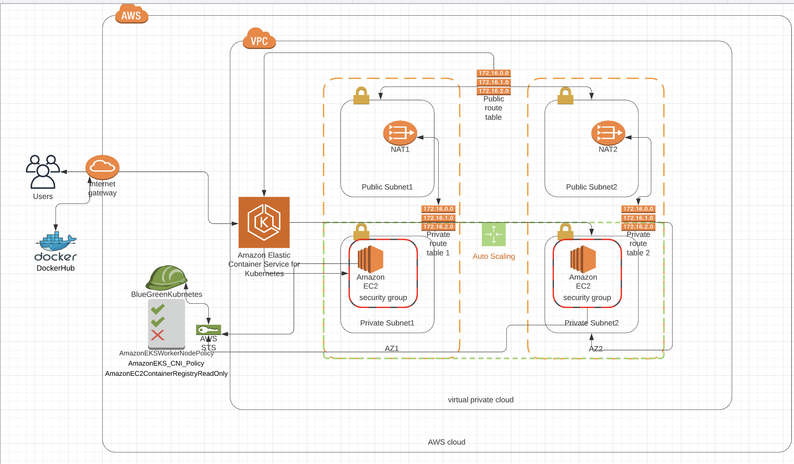

### AWS EKS - Blue/Green deployment



## Overview
This project uses cloudformation to build the aws infrastructure. Then AWS EKS is used to create a Kubernetes cluster. Once the infrastruture ready, blue/green sample application is deployed to Kubernetes cluster. Application is made available to public using loadbalancer service. The project also demonstrtates the capability to switch blue/green deployment by updating the loadbalancer service.

Technologies/Concepts used:
1. AWS
2. Docker
3. Kubernetes - AWS EKS 
4. Jenkis

## &emsp; &emsp; &emsp; &emsp; &emsp; &emsp; &emsp; &emsp; &emsp; &emsp;Project Setup

## Create Infrastructure
To deploy the infrastructure execute the create.sh script with following parameters &nbsp;
``` sh ./create.sh DevOpsCapstoneProject eks_cloud_infrastrucure.yml eks_cloud_infrastrucure.json ```

## Setup Jenkins pipline to create images for blue/green applications in dockerhub
```Jenkinsfile in the repository builds docker images, performs a lint check and publishes to dockerhub```

## Blue Green deployment in AWS EKS cluster.
After the EKS cluster is up and running set context to link credentials to local machine
```aws --region us-east-2 eks update-kubeconfig --name <ClusterName>```

## Apply aws-auth ConfigMap to the cluster
```kubectl apply -f aws_auth_cm.yaml```

## Blue/Green deployment
1.Apply blue deployment ```kubectl apply -f blue-deployment.yml```<br />
2.Apply green deployment ```kubectl apply -f green-deployment.yml```<br />
3.Apply loadbalancer service pointing to blue deployment ```kubectl apply -f blue-green-loadbalancer.yml```<br />
4.To make green service live, change selector in blue-green-loadbalancer.yml service to ```"app": "green"``` <br />
5.Deploy the service again and green deployment should be live<br />
```kubectl apply -f blue-green-loadbalancer.yml```
