# Images of successful deployment completion

#### Jenkins pipeline lint html files step

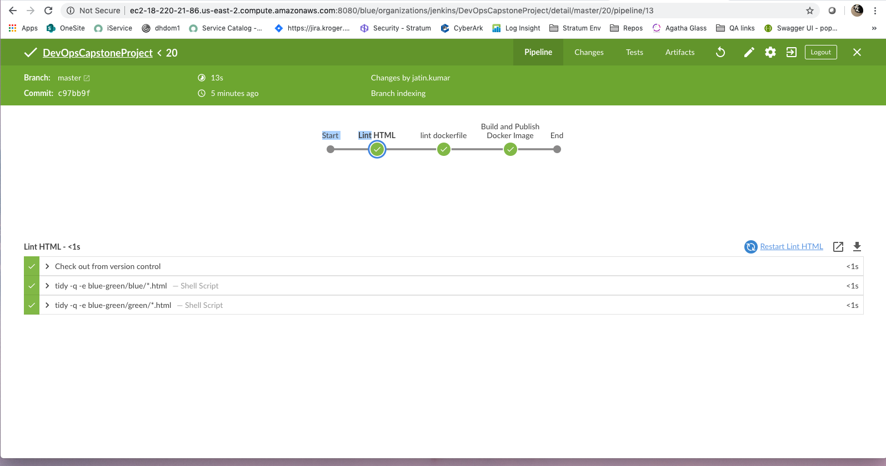

####  Jenkins pipeline lint docker file step

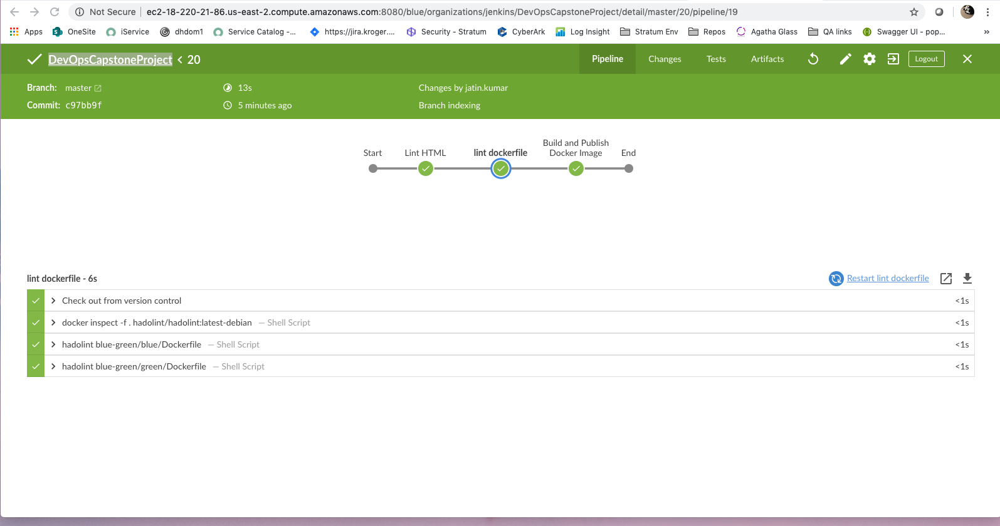

#### Successful push to dockerhub

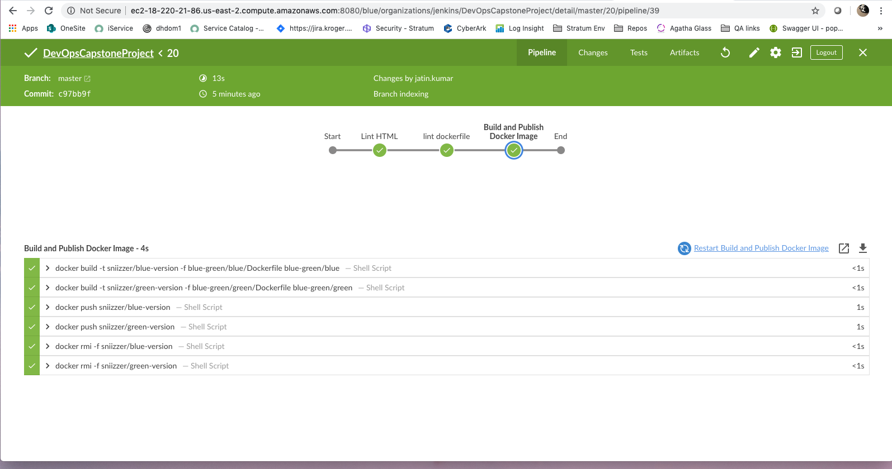

#### Images present in dockerhub

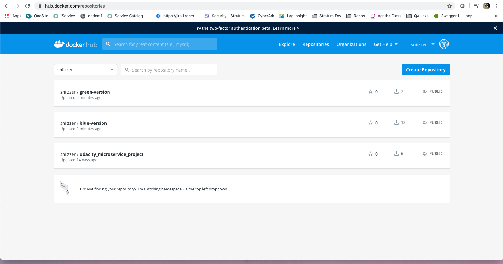

#### Create AWS EKS stack

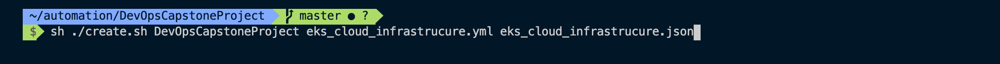

#### Stackid

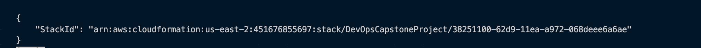

#### Stack Created

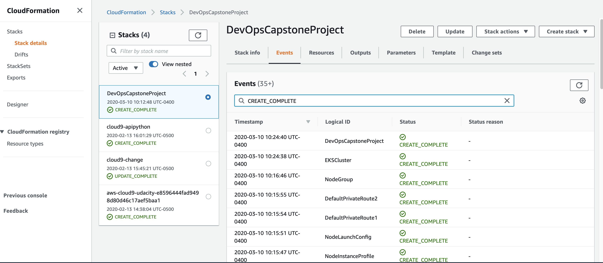

#### Cluster is active

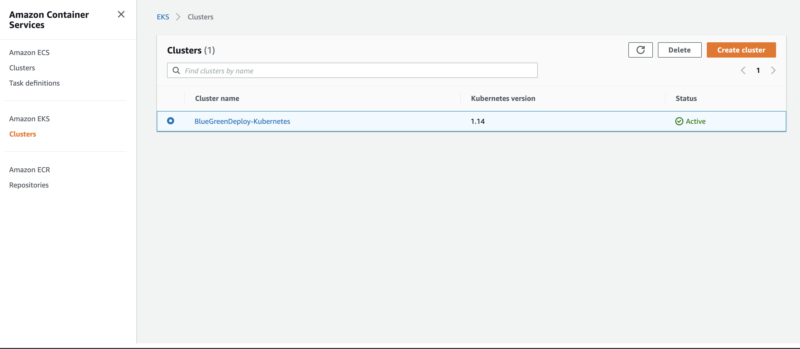

#### Nodes_in_running_state

#### Create kubeconfig and apply aws-iam-authenticator

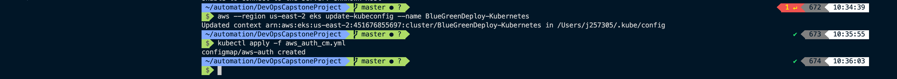

#### Create blue, green deployments and loadbalancer service

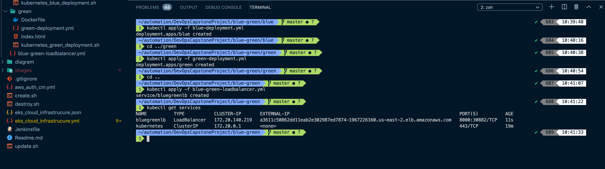

#### Open blue app in the browser

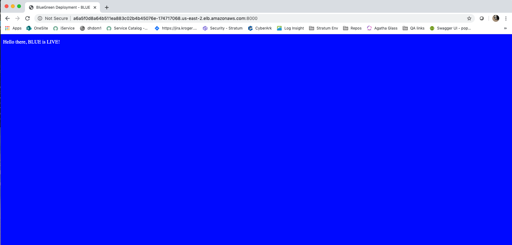

#### Update loadbalancer service to make green service live

#### Load balancer now points to the green app

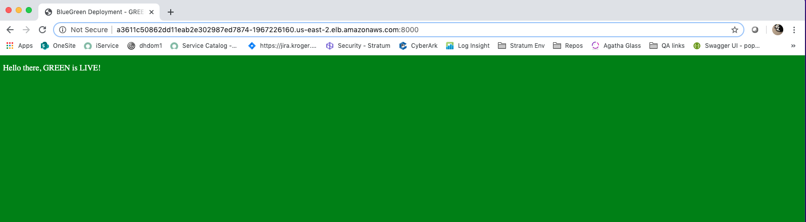
