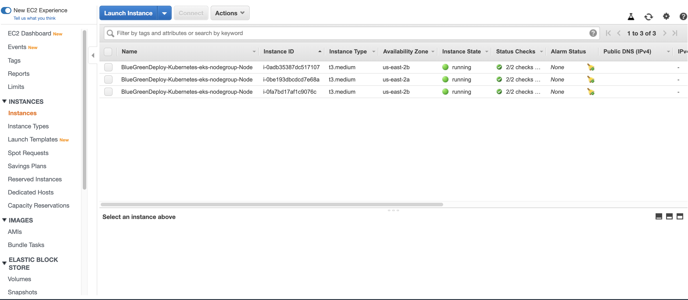
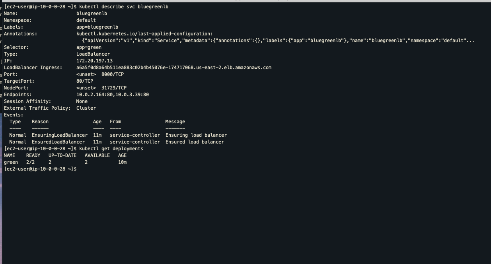

# Images of successful deployment completion

#### Jenkins pipeline lint html files step

####  Jenkins pipeline lint docker file step

#### Successful push to dockerhub

#### Images present in dockerhub

#### Create AWS EKS stack

#### Stackid

#### Stack Created

#### Cluster is active

#### Nodes_in_running_state

#### Open blue app in the browser

#### Blue deployment is active and load balance points to blue deployment

#### New code commit triggers the Jenkins pipeline. It creates a new green deployment, patches load balancer to point to green deployment once it becomes available and then deletes the blue deployment

#### Green is Live

#### Green is Live

